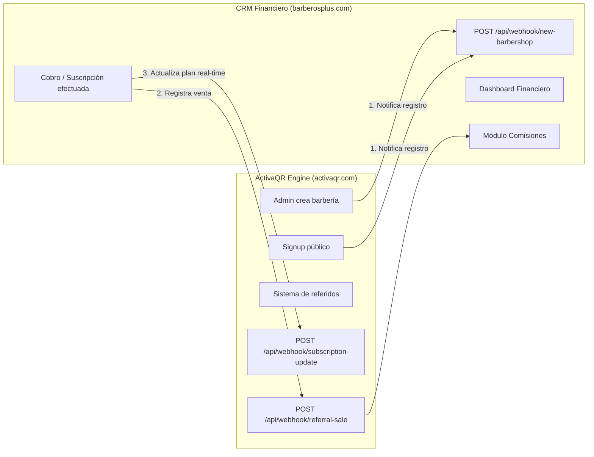

# 📘 Especificación Técnica — Integración CRM Financiero con ActivaQR / BarberOS

**Dominio Producción:** `https://barberosplus.com`  
**Proyecto Origen (Motor SaaS):** ActivaQR / BarberOS  
**Destinatario:** Desarrollador Backend CRM Financiero  
**Versión:** 2.1.0 — Con Endpoints Completos Bidireccionales  
**Fecha:** 12 de Agosto, 2026

---

## 1. Arquitectura de Integración



---

## 2. Autenticación — Configuración Requerida

Todos los webhooks entre ambos sistemas usan una **API Key compartida** enviada en el header `x-api-key`.

### Variables de Entorno Compartidas

| Variable | Dónde se configura | Valor Actual |
| :--- | :--- | :--- |
| `REFERRAL_WEBHOOK_KEY` | `.env` de ActivaQR y CRM | `bk_live_9f83a710e42d8c91b53e77f0a421bc06` |
| `BARBEROSPLUS_WEBHOOK_URL` | `.env` de ActivaQR | `https://barberosplus.com/api/webhook/new-barbershop` |

---

## 3. Catálogo de Webhooks del Sistema

| Endpoint | Emisor | Receptor | Propósito |
| :--- | :--- | :--- | :--- |
| `POST /api/webhook/new-barbershop` | ActivaQR | CRM | Notifica la creación de una barbería |
| `POST /api/webhook/referral-sale` | CRM | ActivaQR | Registra la venta y asigna comisión al vendedor |
| `POST /api/webhook/subscription-update` | CRM | ActivaQR | Actualiza plan (`ACTIVE`, `SUSPENDED`, `CANCELLED`) en ActivaQR |

---

### 3.1 `POST /api/webhook/new-barbershop` (CRM recibe)

**URL completa:** `https://barberosplus.com/api/webhook/new-barbershop`

#### Request enviado por ActivaQR:
```json
{
  "event": "barbershop_created",
  "barbershop": {
    "name": "Barbería El Imperio VIP",
    "phoneBusiness": "593991234567",
    "phonePersonal": "593963410409",
    "plan": "PRO",
    "source": "public_signup"
  },
  "timestamp": "2026-08-12T19:35:00.000Z"
}
```

#### Response esperada por ActivaQR:
```json
{
  "hasCommission": true,
  "referredBy": {
    "name": "Santiago Vendedor",
    "code": "X7K9M2A1"
  }
}
```

---

### 3.2 `POST /api/webhook/referral-sale` (ActivaQR recibe)

**URL completa:** `https://activaqr.com/api/webhook/referral-sale`

#### Request enviado por el CRM a ActivaQR:
```json
{
  "event": "sale_completed",
  "transaction_id": "PAYPHONE_TX_44819",
  "client": {
    "name": "Barbería El Imperio VIP",
    "phones": ["593991234567", "593963410409"]
  }
}
```

#### Respuesta de ActivaQR:
```json
{
  "success": true,
  "matched": true,
  "referrer": {
    "id": "cld_vendor_001",
    "businessName": "Distribuidor VIP",
    "representative": "Santiago Vendedor",
    "whatsapp": "593963410409"
  },
  "message": "Comisión asignada exitosamente a Distribuidor VIP"
}
```

---

### 3.3 `POST /api/webhook/subscription-update` (ActivaQR recibe)

**URL completa:** `https://activaqr.com/api/webhook/subscription-update`

**Propósito:** Cuando un cliente paga en el CRM, el CRM llama a este endpoint en ActivaQR para activar o suspender el acceso de la barbería en tiempo real sin intervención manual.

#### Request enviado por el CRM a ActivaQR:
```http
POST /api/webhook/subscription-update HTTP/1.1
Host: activaqr.com
Content-Type: application/json
x-api-key: bk_live_9f83a710e42d8c91b53e77f0a421bc06
```

```json
{
  "event": "subscription_updated",
  "whatsappNumber": "593991234567",
  "planStatus": "ACTIVE",
  "planType": "PRO",
  "trialEndsAt": null
}
```

| Campo | Tipo | Requerido | Descripción |
| :--- | :--- | :--- | :--- |
| `event` | `string` | ✅ | Siempre `"subscription_updated"` |
| `whatsappNumber` | `string` | ✅* | Teléfono de la barbería (E.164). *(O `barbershopId`)* |
| `planStatus` | `string` | ❌ | `"ACTIVE"`, `"TRIAL"`, `"PAST_DUE"`, `"SUSPENDED"`, `"CANCELLED"` |
| `planType` | `string` | ❌ | `"PRO"`, `"PREMIUM"` |
| `trialEndsAt` | `string` | ❌ | Fecha en ISO 8601 (o `null`) |

#### Respuesta de ActivaQR:
```json
{
  "success": true,
  "message": "Estado de suscripción actualizado con éxito para 'Barbería El Imperio VIP'",
  "barbershop": {
    "id": "cm4...123",
    "name": "Barbería El Imperio VIP",
    "whatsappNumber": "593991234567",
    "planStatus": "ACTIVE",
    "planType": "PRO",
    "trialEndsAt": null
  }
}
```

---

## 4. Modelo de Base de Datos del CRM (SQL)

```sql
CREATE TABLE projects (
    id            VARCHAR(36) PRIMARY KEY,
    code          VARCHAR(50) UNIQUE NOT NULL,
    name          VARCHAR(100) NOT NULL,
    domain        VARCHAR(150),
    currency      VARCHAR(3) DEFAULT 'USD',
    is_active     BOOLEAN DEFAULT TRUE,
    created_at    TIMESTAMP DEFAULT CURRENT_TIMESTAMP
);

CREATE TABLE clients (
    id                   VARCHAR(36) PRIMARY KEY,
    project_id           VARCHAR(36) NOT NULL REFERENCES projects(id),
    external_client_id   VARCHAR(100) NOT NULL,
    business_name        VARCHAR(150) NOT NULL,
    vertical             VARCHAR(50) DEFAULT 'BARBERIA',
    owner_name           VARCHAR(100),
    owner_phone          VARCHAR(30),
    whatsapp_business    VARCHAR(30) NOT NULL,
    status               VARCHAR(30) DEFAULT 'TRIAL',
    plan_type            VARCHAR(30) DEFAULT 'PRO',
    trial_ends_at        TIMESTAMP NULL,
    sales_agent_code     VARCHAR(50),
    created_at           TIMESTAMP DEFAULT CURRENT_TIMESTAMP,
    updated_at           TIMESTAMP DEFAULT CURRENT_TIMESTAMP,
    UNIQUE(project_id, external_client_id)
);

CREATE TABLE products_plans (
    id             VARCHAR(36) PRIMARY KEY,
    project_id     VARCHAR(36) NOT NULL REFERENCES projects(id),
    plan_code      VARCHAR(50) NOT NULL,
    name           VARCHAR(100) NOT NULL,
    billing_cycle  VARCHAR(20) NOT NULL,
    price          DECIMAL(10, 2) NOT NULL,
    currency       VARCHAR(3) DEFAULT 'USD',
    is_active      BOOLEAN DEFAULT TRUE,
    created_at     TIMESTAMP DEFAULT CURRENT_TIMESTAMP
);

CREATE TABLE subscriptions (
    id                    VARCHAR(36) PRIMARY KEY,
    client_id             VARCHAR(36) NOT NULL REFERENCES clients(id),
    plan_id               VARCHAR(36) NOT NULL REFERENCES products_plans(id),
    status                VARCHAR(30) NOT NULL,
    amount                DECIMAL(10, 2) NOT NULL,
    trial_ends_at         TIMESTAMP NULL,
    current_period_start  TIMESTAMP NOT NULL,
    current_period_end    TIMESTAMP NOT NULL,
    canceled_at           TIMESTAMP NULL,
    created_at            TIMESTAMP DEFAULT CURRENT_TIMESTAMP,
    updated_at            TIMESTAMP DEFAULT CURRENT_TIMESTAMP
);

CREATE TABLE transactions_payments (
    id                       VARCHAR(36) PRIMARY KEY,
    client_id                VARCHAR(36) NOT NULL REFERENCES clients(id),
    subscription_id          VARCHAR(36) REFERENCES subscriptions(id),
    external_transaction_id  VARCHAR(100) UNIQUE,
    payment_method           VARCHAR(50) NOT NULL,
    amount                   DECIMAL(10, 2) NOT NULL,
    net_amount               DECIMAL(10, 2),
    gateway_fee              DECIMAL(10, 2) DEFAULT 0.00,
    currency                 VARCHAR(3) DEFAULT 'USD',
    status                   VARCHAR(30) NOT NULL,
    paid_at                  TIMESTAMP NULL,
    created_at               TIMESTAMP DEFAULT CURRENT_TIMESTAMP
);

CREATE TABLE sales_agents (
    id                 VARCHAR(36) PRIMARY KEY,
    external_agent_id  VARCHAR(100),
    code               VARCHAR(50) UNIQUE NOT NULL,
    name               VARCHAR(100) NOT NULL,
    phone              VARCHAR(30) NOT NULL,
    dni_cedula         VARCHAR(20),
    business_name      VARCHAR(150),
    address            VARCHAR(200),
    commission_type    VARCHAR(20) DEFAULT 'FIXED',
    commission_value   DECIMAL(10, 2) DEFAULT 0.00,
    payout_method      VARCHAR(50),
    is_active          BOOLEAN DEFAULT TRUE,
    created_at         TIMESTAMP DEFAULT CURRENT_TIMESTAMP
);

CREATE TABLE commissions (
    id                  VARCHAR(36) PRIMARY KEY,
    agent_id            VARCHAR(36) NOT NULL REFERENCES sales_agents(id),
    transaction_id      VARCHAR(36) NOT NULL REFERENCES transactions_payments(id),
    client_id           VARCHAR(36) NOT NULL REFERENCES clients(id),
    gross_sale_amount   DECIMAL(10, 2) NOT NULL,
    commission_amount   DECIMAL(10, 2) NOT NULL,
    status              VARCHAR(30) DEFAULT 'PENDING',
    paid_at             TIMESTAMP NULL,
    payment_reference   VARCHAR(100),
    created_at          TIMESTAMP DEFAULT CURRENT_TIMESTAMP
);

CREATE TABLE webhook_logs (
    id            VARCHAR(36) PRIMARY KEY,
    event_id      VARCHAR(100) UNIQUE NOT NULL,
    event_type    VARCHAR(100) NOT NULL,
    source        VARCHAR(50) NOT NULL,
    payload       JSON NOT NULL,
    processed     BOOLEAN DEFAULT FALSE,
    processed_at  TIMESTAMP NULL,
    error_message TEXT NULL,
    created_at    TIMESTAMP DEFAULT CURRENT_TIMESTAMP
);
```

---

## 5. Checklist de Verificación Final para Desarrolladores

- [x] Endpoint de actualización en ActivaQR creado (`POST /api/webhook/subscription-update`)
- [x] Endpoint de ventas y comisiones activo en ActivaQR (`POST /api/webhook/referral-sale`)
- [ ] Desarrollador CRM debe implementar `POST /api/webhook/new-barbershop` en `barberosplus.com`
- [ ] Desarrollador CRM debe invocar `/api/webhook/subscription-update` cuando reciba o modifique un pago
- [ ] Desarrollador CRM debe invocar `/api/webhook/referral-sale` para liquidar comisiones
